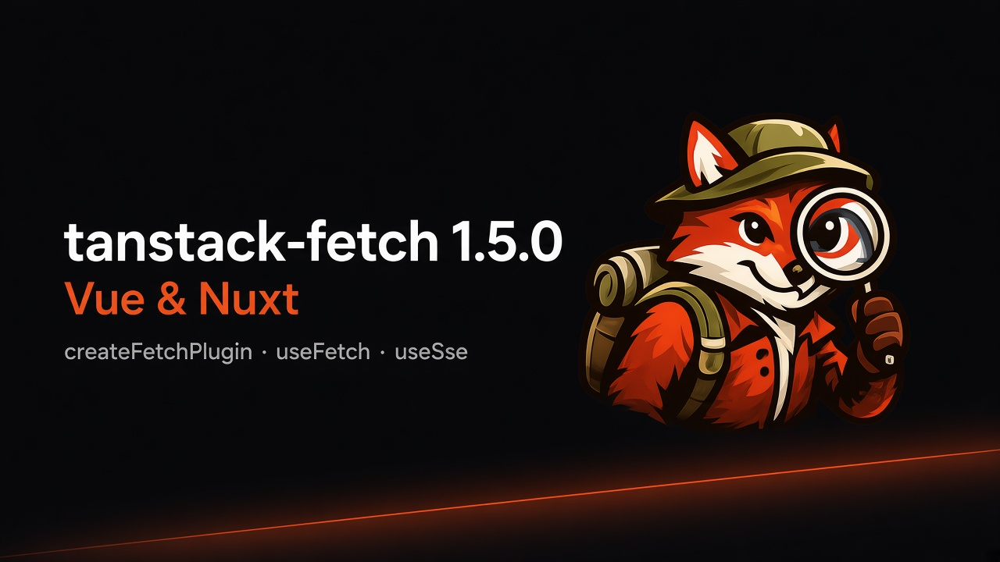

# انتشار tanstack-fetch 1.5.0: پشتیبانی Vue و Nuxt



نسخه **۱.۵.۰** پکیج [tanstack-fetch](https://www.npmjs.com/package/tanstack-fetch) منتشر شد. این نسخه برای **Vue 3** و **Nuxt** هلپرهای رسمی دارد؛ همان مدل ذهنی TanStack Query:

1. در موفقیت **دیتا برگردان**
2. در خطای HTTP **`FetchError` پرتاب کن**
3. **`AbortSignal`** کوئری را پاس بده

هسته HTTP حدود **۴.۸۱KB gzip** است. SSE، پلاگین‌ها، React، Vue، tRPC و DevTools جدا ایمپورت می‌شوند.

مستندات: [mohamadgarmabi.github.io/tanstack-fetch](https://mohamadgarmabi.github.io/tanstack-fetch/)

> این پکیج رسمی TanStack نیست؛ برای مدل ذهنی Query طراحی شده.

## چه چیزی اضافه شده؟

| Export | کاربرد |
| --- | --- |
| `createFetchPlugin` | `app.use` یا پلاگین Nuxt |
| `provideFetchClient` | provide در کامپوننت **والد** |
| `useFetch` | گرفتن کلاینت مشترک از inject (خودش HTTP نمی‌زند) |
| `useSse` | استریم SSE با `status` |

### نکته مهم درباره `useFetch`

`useFetch` این پکیج **دیتا فچ نمی‌کند**؛ فقط همان کلاینت `createFetch` را برمی‌گرداند.

در Nuxt با `useFetch` خود Nuxt تداخل اسمی دارد — این‌طور ایمپورت کنید:

```ts
import { useFetch as useFetchClient } from 'tanstack-fetch/vue'
```

## مثال Vue

```ts
import { createFetch } from 'tanstack-fetch'
import { createFetchPlugin, useFetch } from 'tanstack-fetch/vue'

const api = createFetch({
  baseUrl: import.meta.env.VITE_API_URL,
  getToken: () => localStorage.getItem('access_token'),
})

createApp(App).use(createFetchPlugin({ client: api })).mount('#app')
```

```vue
<script setup lang="ts">
const api = useFetch()
const users = await api.get<User[]>('/users')
</script>
```

## SSE بدون پلاگین

```vue
<script setup lang="ts">
import { createFetch } from 'tanstack-fetch/sse'
import { useSse } from 'tanstack-fetch/vue'

const api = createFetch({ plugins: ['sse-resume'] })
const { data, status, close } = useSse('/orders/stream', { client: api })
</script>
```

`status`: `connecting` | `connected` | `disconnected` | `error`

## Nuxt

```ts
// plugins/tanstack-fetch.ts
import { createFetch } from 'tanstack-fetch/sse'
import { createFetchPlugin } from 'tanstack-fetch/vue'

export default defineNuxtPlugin((nuxtApp) => {
  const api = createFetch({
    baseUrl: useRuntimeConfig().public.apiBase,
    plugins: ['sse-resume'],
  })
  nuxtApp.vueApp.use(createFetchPlugin({ client: api }))
})
```

## لینک‌ها

- راهنمای Vue: https://mohamadgarmabi.github.io/tanstack-fetch/guide/vue  
- پست ریلیز: https://mohamadgarmabi.github.io/tanstack-fetch/blog/tanstack-fetch-1-5  
- npm: https://www.npmjs.com/package/tanstack-fetch  
- گیت‌هاب: https://github.com/mohamadgarmabi/tanstack-fetch  

---

*برچسب‌ها: TypeScript، Vue، Nuxt، Open Source، فرانت‌اند*
