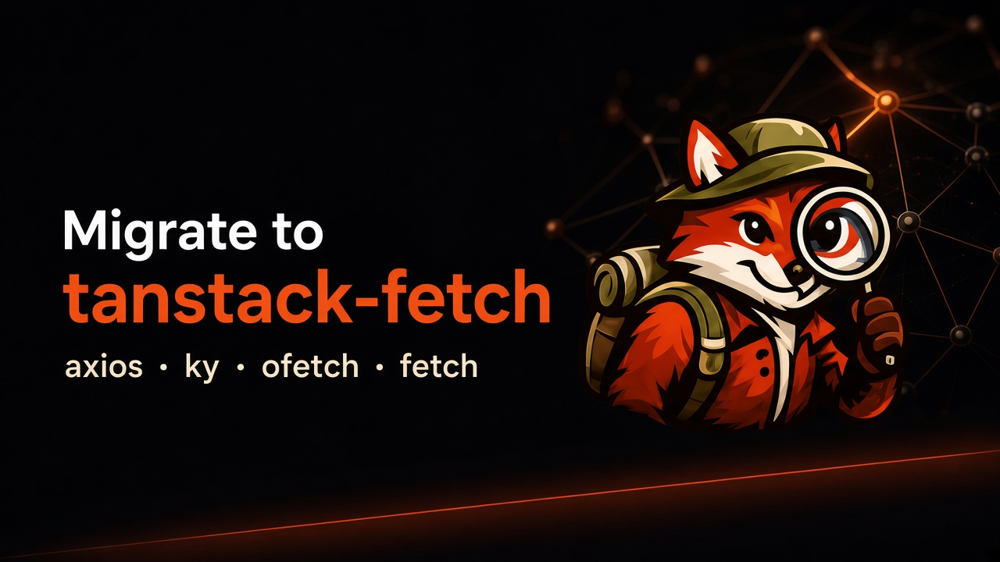

# Migrate axios, ky, ofetch, or fetch to tanstack-fetch in one command



If you use TanStack Query, your `queryFn` already wants three things:

1. **Return data** (not a Response wrapper)
2. **Throw on failure** (so `isError` / `error` work)
3. **Honor `AbortSignal`**

**tanstack-fetch** is shaped for that model. In **1.6.2** it ships a migrate CLI: scan axios / ky / ofetch / raw fetch, apply safe rewrites, and optionally scaffold React, Vue, Nuxt, or Next.js.

> Not an official TanStack package — shaped for the same Query API.

## Before → after

```ts
// before — axios
queryFn: async ({ signal }) => {
  const res = await axios.get('/users', { signal, params: { page: 1 } })
  return res.data
}

// after
queryFn: ({ signal }) =>
  api.get<User[]>('/users', { signal, query: { page: 1 } })
```

## CLI

```bash
npm install tanstack-fetch

npx tanstack-fetch migrate --from all --dir ./src
npx tanstack-fetch migrate --from axios --framework react --write --no-provider
npx tanstack-fetch migrate --from ofetch --framework nuxt --write
npx tanstack-fetch migrate --from fetch --framework nextjs --write
```

| Flag | Meaning |
| --- | --- |
| `--from` | `axios` \| `ky` \| `ofetch` \| `fetch` \| `all` |
| `--framework` | `react` \| `vue` \| `nuxt` \| `nextjs` |
| `--provider` / `--no-provider` | React: include / skip `FetchProvider` (interactive default: **no**) |
| `--write` | Apply safe transforms + write scaffold |

`--write` is conservative. Review findings for query params, interceptors, and manual `res.ok`.

## Mapping

| From | To |
| --- | --- |
| `axios.create({ baseURL })` | `createFetch({ baseUrl })` |
| `res.data` / `.json()` | `api.get` returns data |
| axios `params` / ky `searchParams` | `query` |
| `isAxiosError` | `isFetchError` |

Raw `fetch` is report-first — the CLI flags `fetch(`, `res.ok`, and `.json()`.

## Framework scaffolds

| Framework | What you get |
| --- | --- |
| **react** | `api.ts` + `queries/users.ts` (+ optional provider) |
| **vue** | `api.ts` + plugin |
| **nuxt** | `api` + plugin + `useApi` |
| **nextjs** | client `api.ts` + `api.server.ts` (`ssr-forward` + cookies) |

## Links

- Blog: https://mohamadgarmabi.github.io/tanstack-fetch/blog/tanstack-fetch-1-6-2
- Migrate: https://mohamadgarmabi.github.io/tanstack-fetch/guide/migrate
- npm: https://www.npmjs.com/package/tanstack-fetch
- GitHub: https://github.com/mohamadgarmabi/tanstack-fetch
