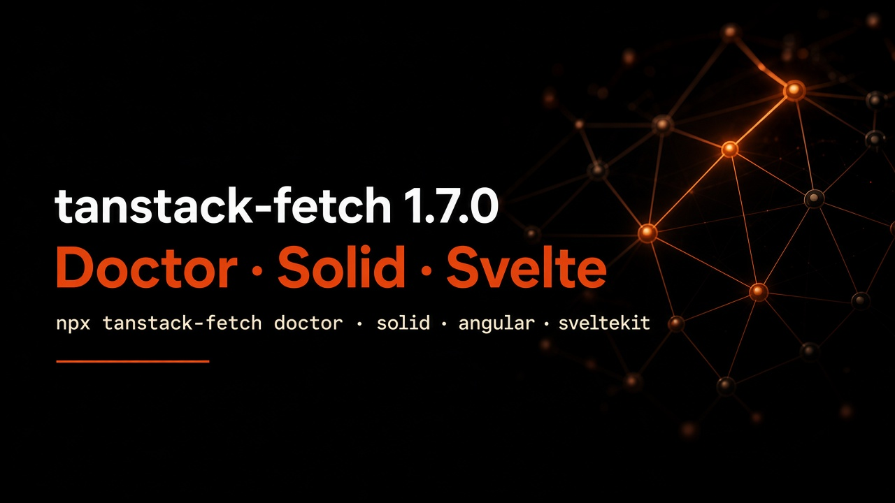

# tanstack-fetch ۱.۷.۰ — آداپتر Solid / Angular / Svelte + دستور doctor



**زیرتیتر:** آداپتر واقعی مثل React/Vue، CLI سلامت پروژه، اسکفولد مایگریت برای Solid / Angular / SvelteKit، پیشرفت دانلود، و فیلتر فریم‌ورک در داک

اگر TanStack Query استفاده می‌کنید، `queryFn` از شما سه چیز می‌خواهد:

1. **دیتا برگرداند** (نه Response خام)
2. **روی خطا throw کند** (تا `isError` درست کار کند)
3. **`AbortSignal` را رعایت کند**

**tanstack-fetch** برای همین مدل ذهنی Query ساخته شده. در **۱.۷.۰** آداپتر واقعی Solid، Angular و Svelte آمده — به‌همراه `doctor`، اسکفولدهای مایگریت بیشتر، `onDownloadProgress`، و picker فریم‌ورک در داک.

> پکیج رسمی TanStack نیست — فقط همان شکل API را هدف گرفته.

مستندات: [بلاگ](https://mohamadgarmabi.github.io/tanstack-fetch/blog/tanstack-fetch-1-7-0) · [Solid](https://mohamadgarmabi.github.io/tanstack-fetch/guide/solid) · [npm](https://www.npmjs.com/package/tanstack-fetch)

## ارتقا

```bash
npm install tanstack-fetch@1.7.0
```

## آداپترها

| Import | API |
| --- | --- |
| `tanstack-fetch/solid` | `FetchProvider`, `useFetch`, `useSse` |
| `tanstack-fetch/svelte` | `setFetchClient`, `useFetch`, `useSse` |
| `tanstack-fetch/angular` | `provideFetchClient`, `injectFetch`, `useSse` |

همان مدل وضعیت SSE مثل React/Vue: `connecting` | `connected` | `disconnected` | `error`.

## Doctor

```bash
npx tanstack-fetch doctor --dir ./src
```

پکیج‌های قدیمی (axios / ky / ofetch)، تعداد `createFetch`، ایمپورت‌های باقی‌مانده، و `queryFn`هایی که احتمالاً `signal` ندارند را چک می‌کند.

## Migrate

```bash
npx tanstack-fetch migrate --from axios --framework solid --write
npx tanstack-fetch migrate --from axios --framework angular --write
npx tanstack-fetch migrate --from fetch --framework svelte --write
npx tanstack-fetch migrate --from fetch --framework sveltekit --write
```

## پیشرفت دانلود

```ts
await api.get('/files/report.pdf', {
  parseAs: 'blob',
  onDownloadProgress: ({ progress, loaded, total }) => console.log(progress, loaded, total),
})
```

## لینک‌ها

- بلاگ: https://mohamadgarmabi.github.io/tanstack-fetch/blog/tanstack-fetch-1-7-0
- Migrate: https://mohamadgarmabi.github.io/tanstack-fetch/guide/migrate
- Upload & download: https://mohamadgarmabi.github.io/tanstack-fetch/guide/upload
- npm: https://www.npmjs.com/package/tanstack-fetch
- GitHub: https://github.com/mohamadgarmabi/tanstack-fetch
